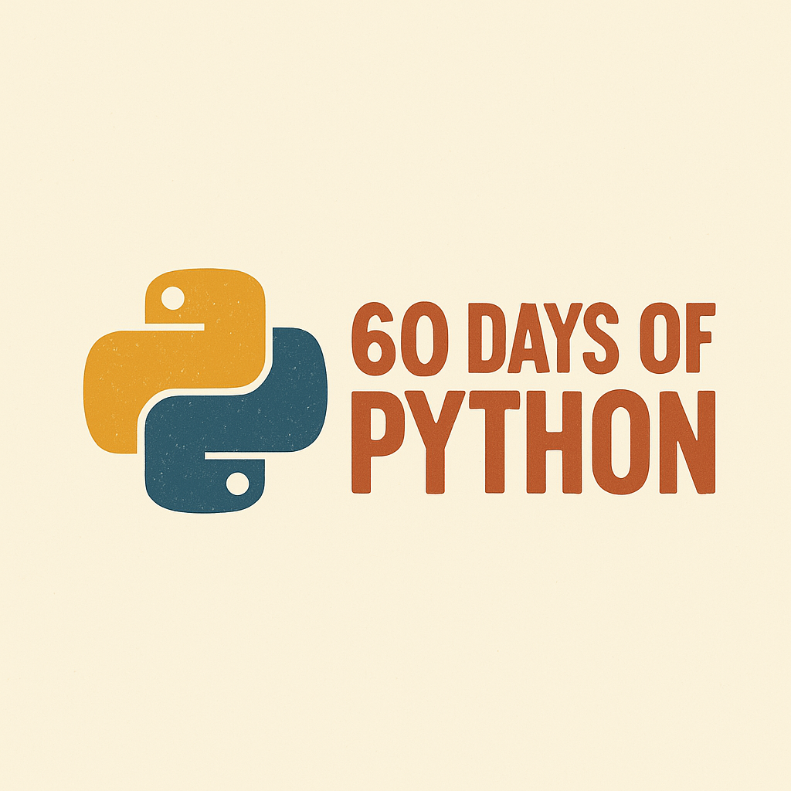

# 🐍 60 DÍAS DE PYTHON - RETO DE PROGRAMACIÓN

¡Bienvenido al reto de **60 Días de Programación con Python**! 🚀  
El objetivo es construir un proyecto o resolver un desafío diario, empezando con fundamentos y subiendo de nivel hacia
APIs, automatización, desarrollo web y ciencia de datos.

Versión [word](https://docs.google.com/document/d/1kbTi_IZrkIQ7h4ZOMg-QYWSi0fN63-pTFT2p9lhOiGY/edit?usp=sharing)

---

## 🗺️ ESTRUCTURA DEL RETO

Cada carpeta contiene el código del desafío del día correspondiente.

- ✅ Día completado
- 🔲 Pendiente

---

## 📅 PROGRESO DEL RETO

### 🧩 Fase 1: Fundamentos de Python (Días 1–15)

| Día |            Proyecto             | Estado |
|:---:|:-------------------------------:|:------:|
|  1  |           Hola Mundo            |   ✅    |
|  2  |       Calculadora Básica        |   ✅    |
|  3  |    Conversor de Temperatura     |   ✅    |
|  4  |    Generador de Contraseñas     |   ✅    |
|  5  |      Contador de Palabras       |   ✅    |
|  6  |           Palíndromos           |   ✅    |
|  7  |   Juego del Adivina el Número   |   ✅    |
|  8  |       Simulador de Dados        |   ✅    |
|  9  |        Cronómetro Simple        |   ✅    |
| 10  |       Calculadora de Edad       |   ✅    |
| 11  | Conversor de Divisas (Estático) |   ✅    |
| 12  |    Gestor de Tareas (Texto)     |   ✅    |
| 13  |  Juego Piedra, Papel o Tijera   |   ✅    |
| 14  |     Organizador de Archivos     |   ✅    |
| 15  |      Tablas de Multiplicar      |   ✅    |

---

### 🌐 Fase 2: Archivos, APIs y Automatización (Días 16–30)

| Día |               Proyecto                | Estado |
|:---:|:-------------------------------------:|:------:|
| 16  |    Lectura y Escritura de Archivos    |   ✅    |
| 17  |        Lector de Archivos JSON        |   ✅    |
| 18  |       API de Chistes Aleatorios       |   ✅    |
| 19  |      Buscador de Canciones (API)      |   ✅    |
| 20  |      Envío de Emails Automáticos      |   🔲   |
| 21  |         Generador de QR Code          |   🔲   |
| 22  |  Web Scraping Básico (BeautifulSoup)  |   🔲   |
| 23  |          Analizador de Logs           |   🔲   |
| 24  | Conversor de Archivos (PDF, Imágenes) |   🔲   |
| 25  |    Descargador de Videos (YouTube)    |   🔲   |
| 26  |        Bot de Telegram Básico         |   🔲   |
| 27  |       Conversor de Texto a Voz        |   🔲   |
| 28  |  Recordatorio Diario (Automatizado)   |   🔲   |
| 29  |  Visualizador de Datos (Matplotlib)   |   🔲   |
| 30  |         Juego de Trivia (API)         |   🔲   |

---

### 🛠️ Fase 3: Web con Flask & Proyectos Intermedios (Días 31-45)

| Día |                 Proyecto                  | Estado |
|:---:|:-----------------------------------------:|:------:|
| 31  |             Mini Blog (Flask)             |   🔲   |
| 32  |      API REST Básica (Flask + JSON)       |   🔲   |
| 33  |      Autenticación Simple con Flask       |   🔲   |
| 34  |  Encuesta Online con Resultados (Flask)   |   🔲   |
| 35  |  Editor de Imágenes Online (PIL + Flask)  |   🔲   |
| 36  |           To-Do App con SQLite            |   🔲   |
| 37  |   Notas con Markdown (Flask + Markdown)   |   🔲   |
| 38  |      Buscador de Libros (API + Web)       |   🔲   |
| 39  |      Clon de Twitter (Mini versión)       |   🔲   |
| 40  |      Chat en Tiempo Real (SocketIO)       |   🔲   |
| 41  |       Blog con Admin Panel (Flask)        |   🔲   |
| 42  | Dashboard de Criptomonedas (API + Charts) |   🔲   |
| 43  |  Buscador de Películas (API + Favoritos)  |   🔲   |
| 44  |          Web para Subir Archivos          |   🔲   |
| 45  |       Portafolio Personal con Flask       |   🔲   |

---

### 🔬 Fase 4: Ciencia de Datos, Django y Automatización Avanzada (Días 46-60)

| Día |                  Proyecto                  | Estado |
|:---:|:------------------------------------------:|:------:|
| 46  |        Análisis de Datos con Pandas        |   🔲   |
| 47  |            Gráficos con Seaborn            |   🔲   |
| 48  |      Web Scraper Avanzado (Selenium)       |   🔲   |
| 49  |       Reconocimiento de Texto (OCR)        |   🔲   |
| 50  | Análisis de Sentimientos (TextBlob + Lang) |   🔲   |
| 51  |   Clasificador de Texto (NLP + Sklearn)    |   🔲   |
| 52  |       Reconocimiento Facial (OpenCV)       |   🔲   |
| 53  |   Clasificador de Imágenes (ML + Keras)    |   🔲   |
| 54  |         Bot de Twitter Automático          |   🔲   |
| 55  |                Django Blog                 |   🔲   |
| 56  |           E-commerce con Django            |   🔲   |
| 57  |             Django + API REST              |   🔲   |
| 58  |   Dashboard Interactivo (Plotly + Flask)   |   🔲   |
| 59  |  Gestor de Proyectos (Django + Kanban UI)  |   🔲   |
| 60  |     Proyecto Final - Full Stack Python     |   🔲   |

---

## 📌 Créditos

Creado por [Hugo Almodóvar Fuster](https://www.linkedin.com/in/hugoalmodovar/)  
Inspirado en el 60 Days Coding Challenge de [@maticukier](https://www.linkedin.com/in/matias-cukier-034004230/)

